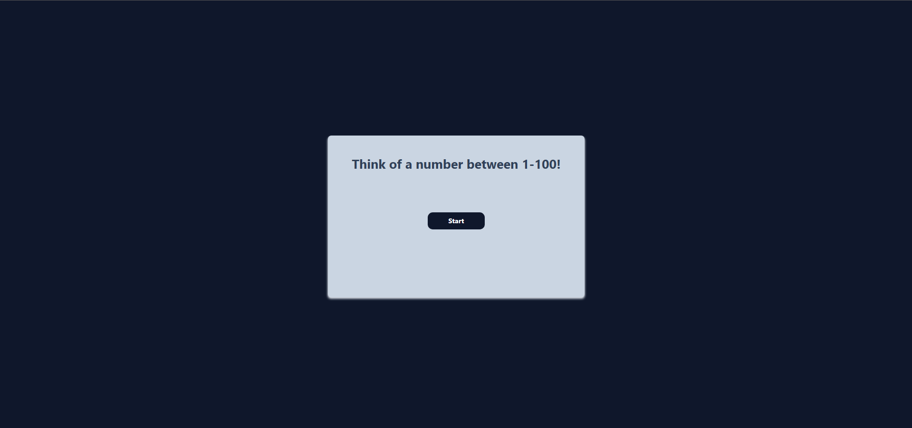

# Reverse Guess – Binary Search Game

A fun number guessing game where the **computer tries to guess your number** using the Binary Search algorithm.  

This is my **first fully self-developed JavaScript project**. I built it to practice DOM manipulation, event handling, and algorithmic thinking. For the design, I used **TailwindCSS** to keep it simple and responsive.  

---

## Features
- Think of a number between 1–100
- The computer guesses and asks: *“Is it Higher, Lower or Right?”*
- Uses the efficient **Binary Search** algorithm
- Reset button to start over anytime

---

## Screenshots

### Screenshot 1

### Screenshot 2

---

## Built With
- **JavaScript** (vanilla)
- **TailwindCSS** (for styling)

---
